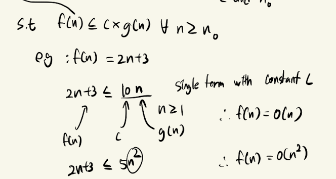
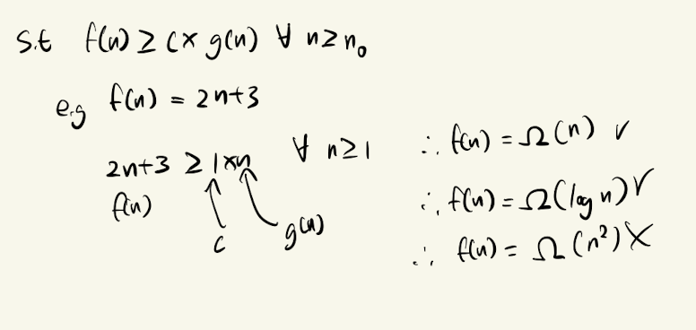
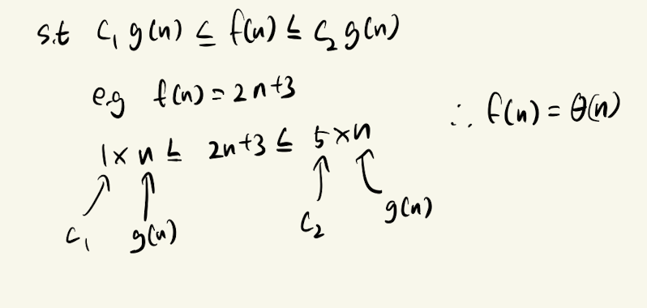
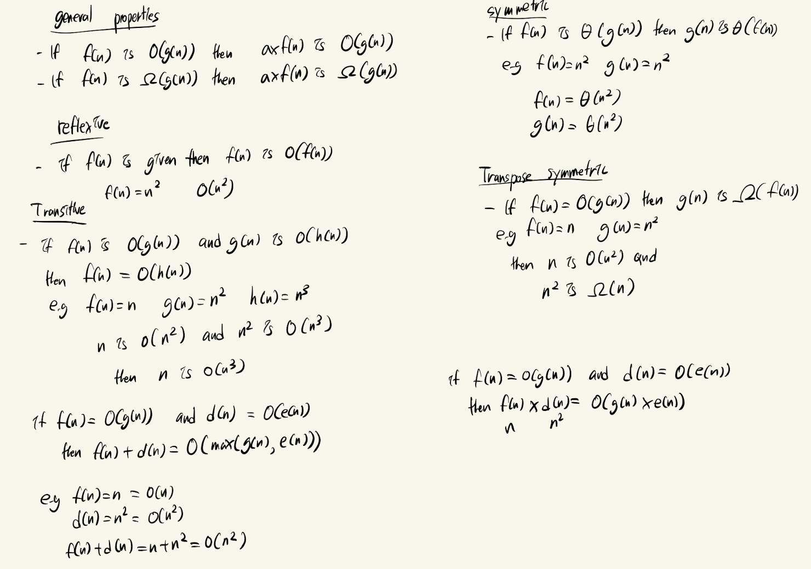
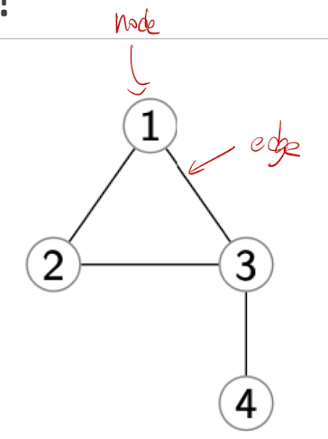

# Analysis of Algorithm & Basic Data Structure

## Asymptotic Notation

| Symbol      | Name     | Meaning       |
|-------------|----------|---------------|
| $O$     | big O    | Upper bound    |
| $\Omega$     | big Omega | Lower bound    |
| $\Theta$     | Theta    | Average bound  |
---------------------------------------------

- Big O
    - The function $f(n) = O(g(n)) \text{ iff } \exists$ positive constants c and $n_0$

- Omega
    - The function $f(n) = \Omega (g(n)) \text{ iff } \exists$ positive constants c and $n_0$

- Theta
    - The function $f(n) = \Theta (g(n)) text{ iff } \exists$ positive constants c and $n_0$

### Properties

## Data Structure

- Given the $G = (V,E),|V| = n, |E| = m$
- Adjacency matrix A: $n^2$ = 16 bytes $\begin{bmatrix}0 & 1 & 1 &0 \\1 & 0 & 1 & 0 \\ 1 & 1 & 0 & 1 \\ 0 & 0 & 1 & 0\end{bmatrix}$
- Adjacency list L: n + 2m = 12 bytes 
$$ 
L_1 \rightarrow \{2,3\} \\L_2 \rightarrow \{1,3\} \\ L_3 \rightarrow \{1,2,4\} \\ L_4 \rightarrow \{3\}
$$

### Stack

### Queue

### Dictionary

### Linked Lists

### Array