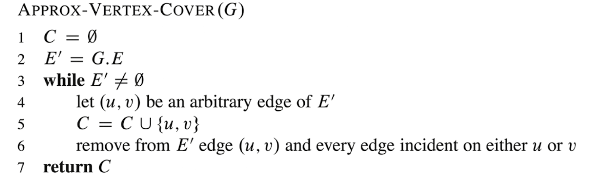
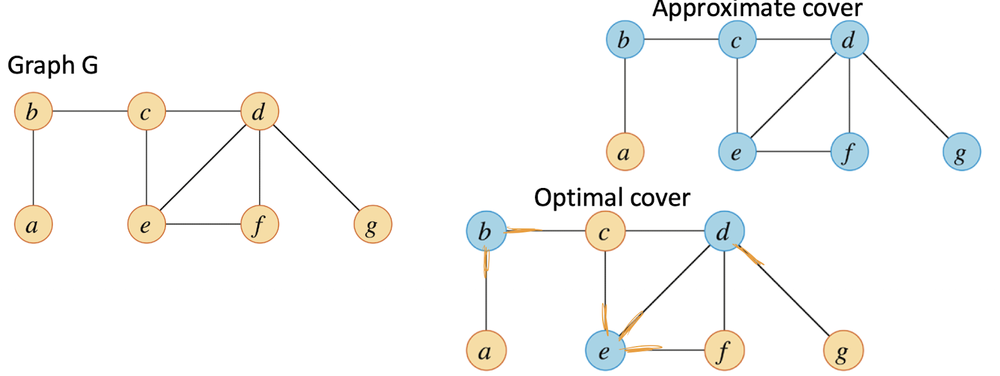
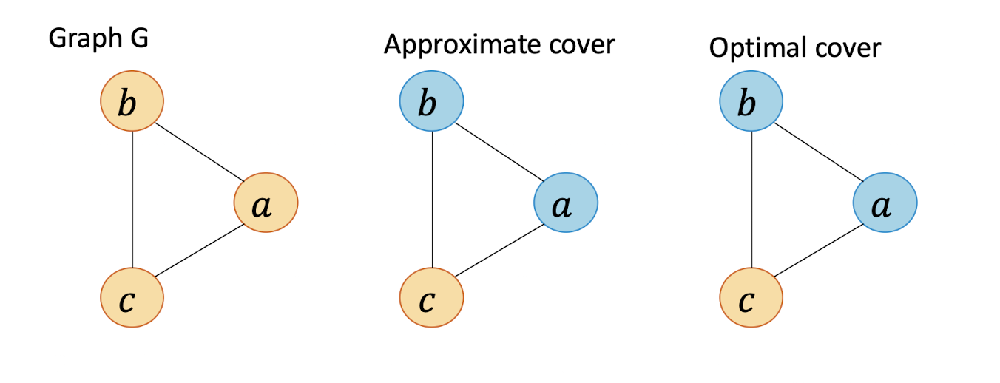
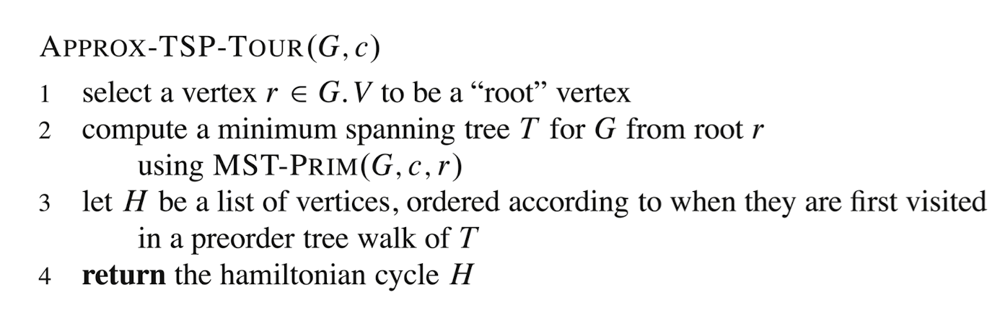
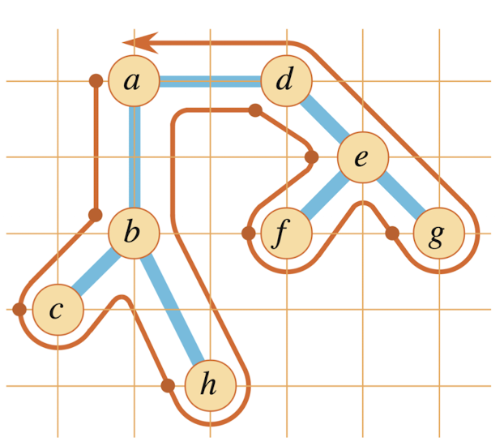
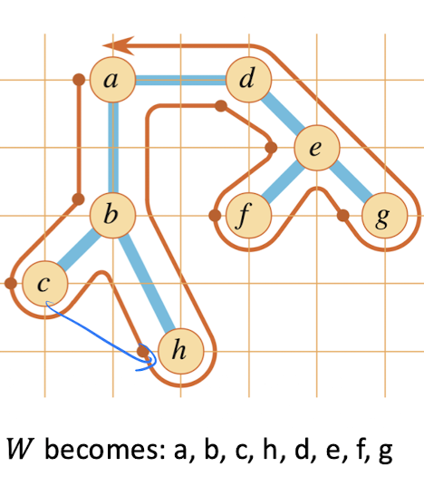

# Approximation Algorithms

- Approximation Algorithm is a polynomial-time algorithm that finds a solution close to the optimal for an optimization problem, especially when solving it exactly is too expensive or infeasible.

## Performance Ratios

- The problem could be a max problem or it could be a min problem

- If the input has size $n$
    - the solution cost of the approximation algorithm is $C$
    - the optimal solution cost is $C^*$
    - this algorithm called a p(n)-approximation algorithm

$$
\text{max} \{ \frac{C}{C^*}, \frac{C^*}{C}\} \leq p(n)
$$

- $\frac{C}{C^*}$ for minimizing
- $\frac{C^*}{C}$ for maximizing

- For minimization problem:
$$
\text{Approximation Ratio } r = \frac{C}{C^*} \geq 1
$$

- For maximization problem:
$$
\text{Approximation Ratio } r = \frac{C^*}{C} \geq 1
$$

## Vertex cover

- Input: Undirected graph $G = (V, E)$

- Output: A minimum-size subset $V' \subseteq V$ such that each edge in $E$ is incident (사건) on at least one vertex $V'$ (V cover all the edges)
    - simpler term: want to cover all edges by placing guards (vertices) so that each edge has at least one end-pointed guarded

### Example 1

### Example 2

### Proof

- It's NP-Complete to find the minimum vertex cover
- There are exponentially many subsets, so brute force takes too long

#### Theorem
Approx-Vertex-Cover is a polynomial-time 2 approximation algorithm

#### Proof of 2-approximation
- Clearly the algorithm is polynomial since the while loop repeats repeats at most $|E|$ times

- Let $C^*$ be an optimal vertex cover and $C$ be our approximate vertex cover
- Let $A$ be the set of edges chosen in the while loop.
- To cover edges in $A$, any vertex cover must include at least one endpoint of each edge
    - Any valid vertex cover (including the optimal one) must cover every edge in $A$
    - So it has to include at least one vertex per edge
    - This gives us a lower bound
    $$ 
    |C^*| \geq |A|
    $$
- No two edges in $A$ share an endpoint
    - After we pick edge $(u, v)$, you delete all other edges incident to $u$ or $v$
    - That means no later edge in $A$ will touch $u$ or $v$
    - So all the edges in $A$ are disjoint - no overlapping vertices
    - each edge is independent, so the optimal cover has to cover each one seperately
- Since the edges are disjoint, and every edge needs at least one vertex to cover, the optimal cover $C^*$ must contain at least one vertex per edge
    $$
    |C^*| \geq |A|
    $$
- Each time Approx-Vertex-Cover chooses an edge, it adds two vertices to $C$
    - for each edge $(u, v) \in A$, you add both $u$ and $v$
    $$
    |C| = 2|A|
    $$
- From the above
    - Optimal size $|C^*| \geq |A|$
    - Solution size $|C| = 2|A|$
    $$
    |C| = 2|A| \leq 2|C^*|
    $$
This proves that the cover is at most 2x the optimal $\rightarrow$ 2-approximation

## Traveling Salesperson Problem

- Input: A complete undirected graph $G = (V, E)$ with a nonnegative cost $c(u, v)$ for each edge $(u, v) \in E$
    - Can I visit all vertex?
- Output: A tour (a hamiltonian cycle - cycle that visits every vertex) with minimum total cost

### The Triangle Inequality

Assume that the triangle inequality holds:
$$
c(u, w) \leq c(u, v) + c(u, w) \quad \forall u, v, w \in V
$$
- $c(u, v) + c(u, w)$ is the sum of two side
- The triangle inequality does not always hold, but it does in many use caes
    - euclidean distances
- If the triangle inequality holds, we can approximate in polynomial time
- If the triangle inequality does not hold, we cannot approximate in polynomial time
- TSP is NP-complete when the triangle inequality holds

### Approximation of TSP
Idea
- Construct a MST
- Do a preorder walk of the tree
- Construct the TSP tour in the order in which each vertex is first visited during the preorder walk

- MST-PRIM takes $O(V^2)$
- Preorder walk become hamiltonian cycle

- A complete (graph is fully connected) undirected graph

### Proof

#### Theorem
APPROX-TSP-TOUR is a polynomial-time 2-approximation algorithm for the traveling salesperson problem with the triangle inequality

#### Proof of 2-approximation
- Finding the MST can be done in $\theta (V^2)$ and preorder walkthrough is $\theta (V)$, thus, this algorithm is clearly polynomial-time
- Next, need to show that the cost of the tour is at most 2 times the cost of an optimal tour

- For any subset $A \subseteq E$ of edges, let $c(A) = \sum_{(u, v) \in A} c(u, v)$ be the total cost of the edges in A

- Let T be the MST and $H^*$ be the optimal tour
- If we remove one edge from the tour $H^*$, we get a tree $T^*$
- Since we had to remove an edge from H to build T, then $c(T^*) \leq c(H^*)$
- And since $T$ and $T^*$ are both trees, it must be the case that $c(T) \leq c(T^*)$
    - Since T is MST, it must be smaller than $T^*$
- Thus: $c(T) \leq c(T^*) \leq c(H^*)$

- Consider a walk W through the MST tree
- We walk down then up the edges of the tree. Thus, we visit each edge twice
- So $c(W) = 2c(T)$
- A walk W is not a tour since it visits each vertex more than once
- To make it a tour, we **remove duplicate** vertices in the path and only leav the first instance of each vertex
- By the triangle inequality, the total cost cannot increase. If W contains vertices $u, v, w$ in order then be removing $v$, we have
$$
c(u, w) \leq c(u, v) + c(v, w)
$$
    - Take the shortcut instead of visiting same edge twice
    
- We get tour H such that $c(H) \leq c(W)$
- It follows that: $c(H) \leq c(W) = 2c(T) \leq 2c(T^*) \leq 2c(H^*)$
- Showing $c(H) \leq 2c(H^*)$
- Thus, APPROX-TSP-TOUR is a polynomial-time 2-approximation algorithm