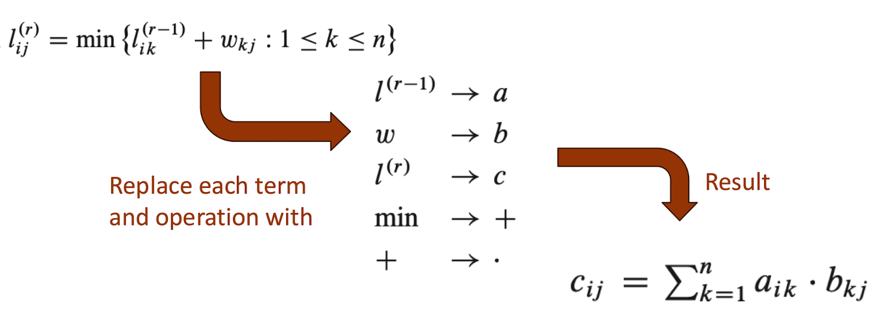
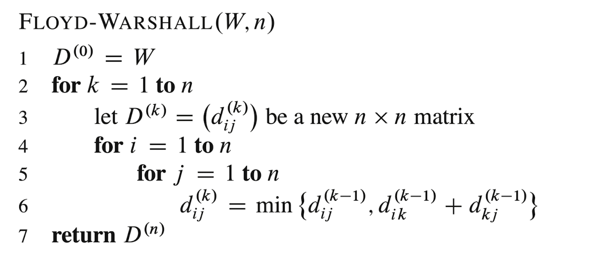

# All Pairs Shortest Paths

Chapter 24

[All Pairs Shortest Path (Floyd-Warshall) - Dynamic Programming](https://www.youtube.com/watch?v=oNI0rf2P9gE) by Abdul Bari

Given a directed graph $G = (V, E)$, weight function w and $|V| = n$. Assume that the vertices are numbered $1, 2,..., n$.
Compute the shortest path distance between every pair of vertices $(u, v)$

**Goal** is to create an $n$ x $n$ matrix $D = (d_{ij})$ of shortest path distance, so that $d_{ij} = \delta (i, j)$ for all vertices $i$ and $j$.

- Works both directed and undirected graphs
- Can handle negative weights (as long as no negative cycle)

- Could run Dijkstra's algorithm once for each vertex: $O(VElogV)$
    - If graph is dense then $E = V^2$ then time is $O(V^3logV)$

## Shortest Paths and Matrix Multiplication
Assume that G is given as adjacency matrix of weights: $W = (w_{ij})$ with vertices number 1 to n

$$
w_{ij} = 
\begin{cases}
0 & \text{if } i = j \\
\text{weight of edge}(i, j) & \text{if } i \neq j, (i, j) \in E \\
\infty & \text{if } i \neq j, (i, j) \not\in E
\end{cases}
$$

### Recursive solution

#### Base case
Let $l_{ij}^{(r)}$ = weight of shortest path from $i$ to $j$ that contains less than $r$ edges
- r = 0
    - There is a shortest path from $i$ to $j$ with less than 0 edges if and only if $i = j$
    $$
    l_{ij}^{(0)} =
    \begin{cases}
    0 & \text{if } i = j \\
    \infty & \text{if } i \neq j
    \end{cases}
    $$
Let $l_{ij}^{(r)}$ = weight of shortest path from $i$ to $j$ that contains less than or equal $r$ edges
- r = 1
    - There is a shortest path from $i$ to $j$ with less than or equal to 1 edge if and only if $i \rightarrow j$
    $$
    l_{ij}^{(r)} = l_{ij}^{(0)} + w_{ij} = w_{ij}
    $$

#### Recursively
- r $\geq$ 1
$$
l_{ij}^{(r)} = min \{l_{ij}^{(r - 1)}, min\{l_{ij}^{(r - 1)} + w_{kj}:1 \leq k \leq n\} \} \text{ ($k$ ranges over all possible predecessors of j)}
=  min\{l_{ij}^{(r - 1)} + w_{kj}:1 \leq k \leq n\} \text{ (since $w_{jj} = 0$ for all j)}
$$

- All simple shortest paths contains less than $|V| - 1$ edges. Let $|V| = n$ then
$$
\delta (i,j) = l_{ij}^{(n - 1)} = l_{ij}^{(n)} = l_{ij}^{(n + 1)} = ...
$$

### Bottom up
Compute $L^{(1)}, L^{(2)},..., L^{(n - 1)}$

Start with $L^{1} = W$, since $l_{ij}^{(1)} = w_{ij}$

Go from $L^{(r - 1)}$ to $L^{(r)}$:

```
EXTEND-SHORTEST-PATHS(L^(r - 1), W, L^r, n)
for i = 1 to n
    for j = 1 to n
        for k = 1 to n
            D[i][j] = min(D[i][j], D[i][k] + D[k][j])
```

#### Slow APSP
```
SLOW-APSP(W[1..n][1..n]):
    L ← W
    for m = 2 to n - 1:
        L ← EXTEND-SHORTEST-PATHS(L, W)
    return L
```


#### Fast APSP

- Compute $A, A^2, A^4, A^8$ using exponentiation by squaring
- Stop when the path length exceeds n - 1

```
FAST-APSP(W[1..n][1..n]):
    L ← W
    m ← 1
    while m < n - 1:
        L ← EXTEND-SHORTEST-PATHS(L, L)
        m ← 2 * m
    return L
```

### Floyd-Warshall Algorithm
