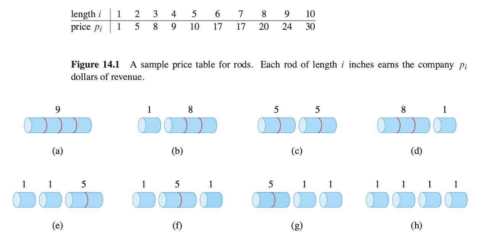
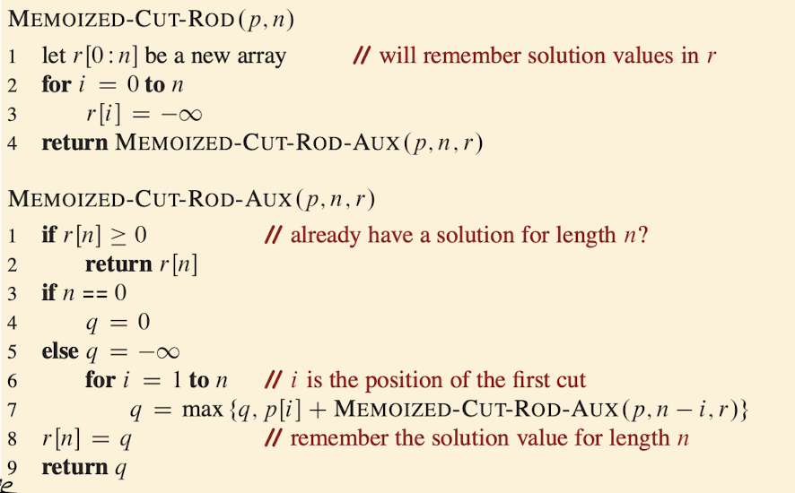
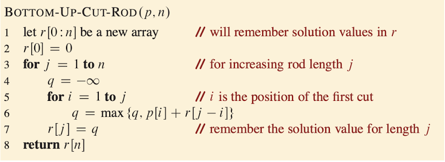
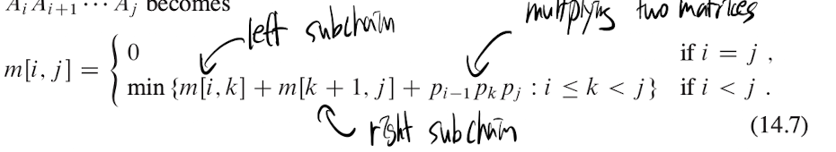

# Dynamic Programming

## Rod Cutting

$$
r_n = \text{max} \{p_n, r_1 + r_{n-1}, r_2 + r_{n-2},..., r_{n-1} + r_1\}
$$

- The first argument, $p_n$ , corresponds to making no cuts at all and selling the rod of length n as is. 
- The other n - 1 arguments to max correspond to the maximum revenue obtained by making an initial cut of the rod into two pieces of size i and n - i, for each $i = 1, 2,..., n - 1$, then optimally cutting up those pieces further, obtaining revenues $r_i$ and $r_{n-i}$ from those two pieces.

### Top-Down solution

- Also called memoization

- starting from the original problem, breaking it down into subproblems recursively, whhile caching the results of subproblems so it does not recompute.

- It can save cached result in somewhere else such as array or recursion.

- Without memoization the runtime for building recursion tree: $\Theta (2^n)$, with $2^{n-1}$
    $$
    T(n) = T(n - 1) + T(n - 2) + O(1) = \Theta(2^n)
    $$
- There are n subproblems, each subproblem takes n times for looping choices $O(n^2)$

- Questions be like: what is best for 4?

### Bottom-up solution

- solve smallest to bigger

## Matrix-chain multiplication

- Find best way to parenthesize the matrix product to minimize the scalar multiplication

- Depending on order, cost is different

- For example
    - $A_1$ 10 x 100
    - $A_2$ 100 x 5
    - $A_3$ 5 x 50
- ($A_1$ $A_2$) $A_3$
    - (10 x 100) x (100 x 5) = 5000
    - (10 x 5) x (5 x 50) = 2500
    - = 7500
- $A_1$ ($A_2$ $A_3$)
    - (100 x 5) x (5 x 50) = 25000
    - (10 x 100) x (100 x 50) = 5000
    - = 30000

- choose k index to split matrix into two parts such as
    - $A_i,..., A_k$ and $A_{k+1},..., A_j$ $i < j$
    - Time: $O(n^3)$
    - Space: $O(n^2)$ - DP table

- m[i,j] = min number of scalar multiplications need to compute project
    - try to split position k in between i and j
    - combine left and right split cost
    - add the cost of multiplying left and right matrices

## Elements of Dynamic Programming

- If the solution to problem depending on solving smaller subproblems, combining them leads to the best result leading to the best result, it has optimal substructure

- If recursion keeps solving same input repeatly, there is overlapping subproblems

- Top-Down (memoization): recursion + cache
- Bottom (Tabulation): fill the table from the base cases up

## Longest Common Subsequence

- Given the two string x and y, find the maximum length subsequence that exists in both

- x be length of m
- y be length of n
- L[i][j] = length of LCS
    - the first i char of x
    - the first j char of y
1. if either string is empty
2. if x[i - 1] = y[j - 1], if the current character match
    - then L[i - 1][j - 1] + 1, then they extend the LCS of previos prefix, adding 1 to the LCS of remaining part
    - then include the character, look at the best LCS for x[0,..., i - 2] and y[0,..., j - 2]
3. if x[i - 1] $\neq$ y[j - 1], if character does not match
    - then $L[i][j] = max{L[i - 1][j], L[i][j - 1]}$
    - choose the best option
        - skip the current char of x $\rightarrow$ check L[i - 1][j] 
        - skip the current char of y $\rightarrow$ check L[i][j - 1]
- Runtime $\Theta$(mn)
- Space $\Theta$(mn), can be optimized to $n^2$
