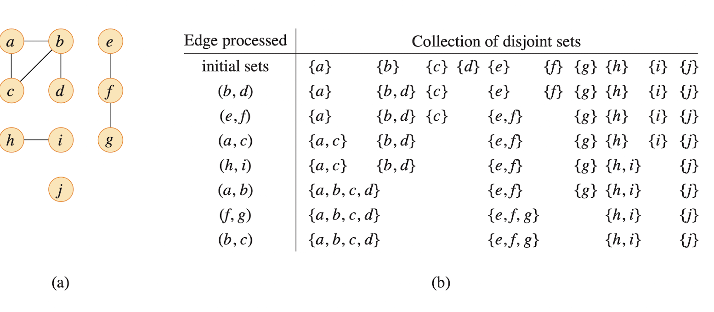
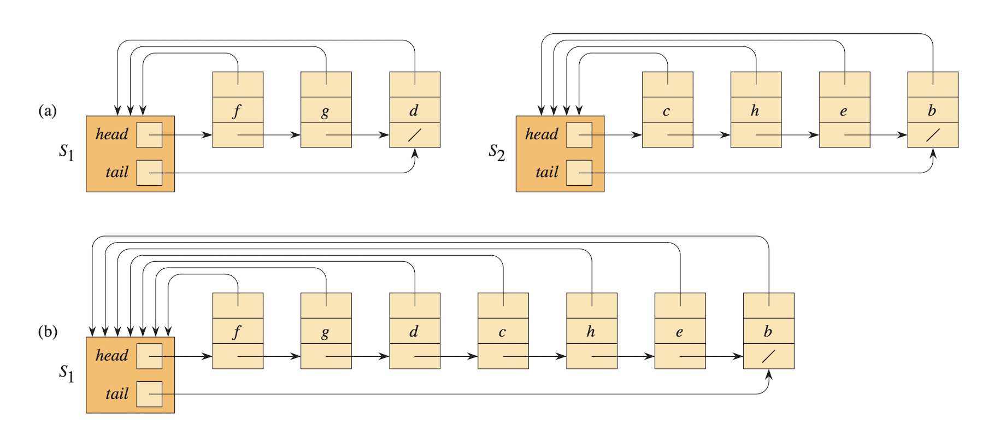
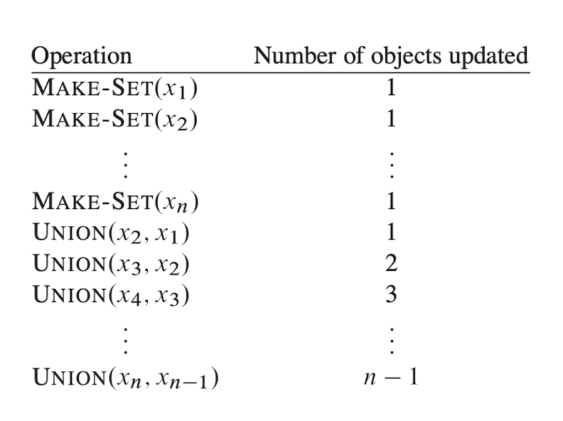

# Disjoint Sets

- Disjoint = two sets that don't have anything in common

Let $s_1 = \{1, 2, 3, 4\}$ and $s_2 = \{5, 6, 7, 8\}$. 

They are disjoint set because they both don't have anything common.

## Disjoint Set operations

**MAKE-SET(x)**, where x does not already belong to some other set, creates a new set whose only member (and thus representative) is x

**UNION(x, y)**: x, y in different and make them connect

**FIND-SET(x)**: find out which vertex belongs to which set

## Application of disjoint set data structure

- disjoint data structure arises in determining the connected components of an undirected graph

- After making set union and looking at edge and 2 vertices find in the one set, there is cycle

## Linked list representation of disjoint sets

- 2n - 1 operations
- n objects
- $\Theta(n^2)$
- $\Theta(n)$ time per operation