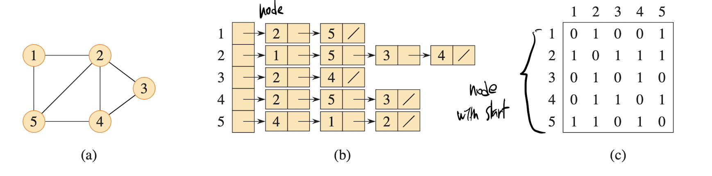
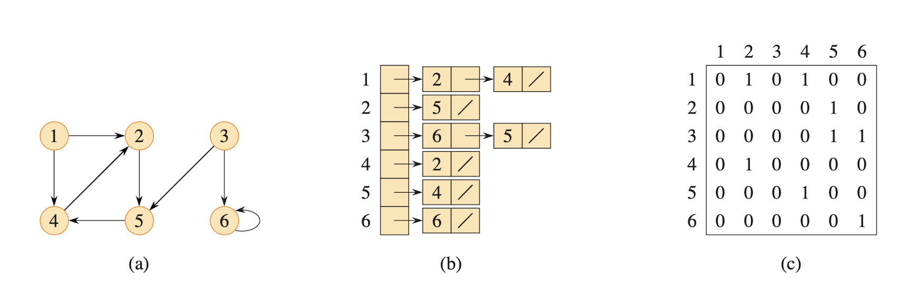
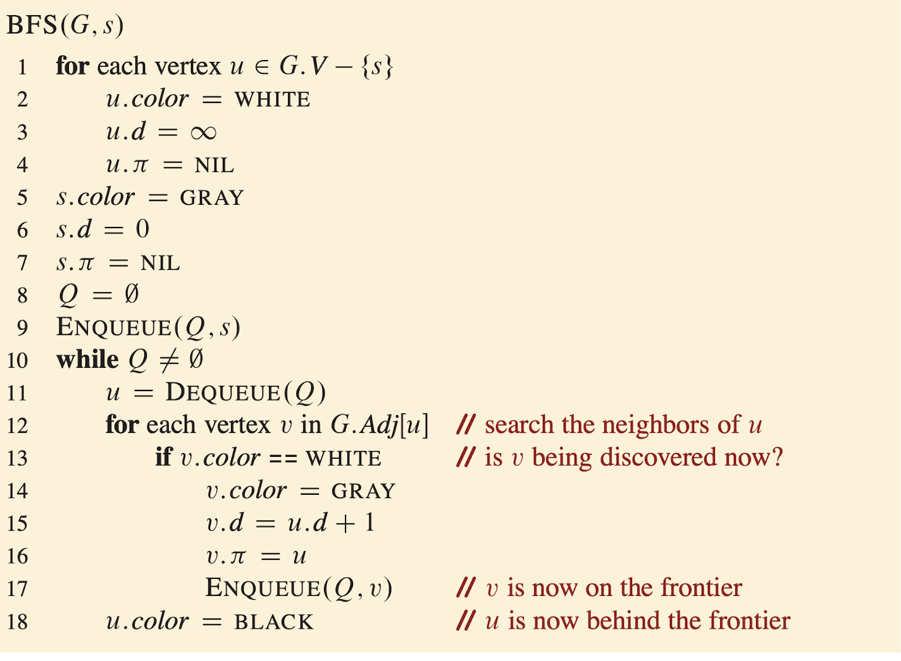
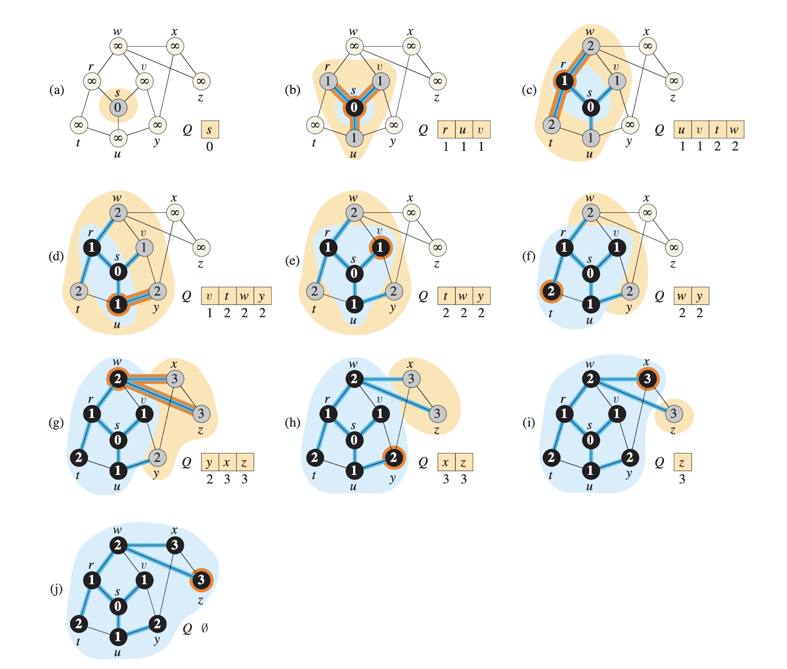
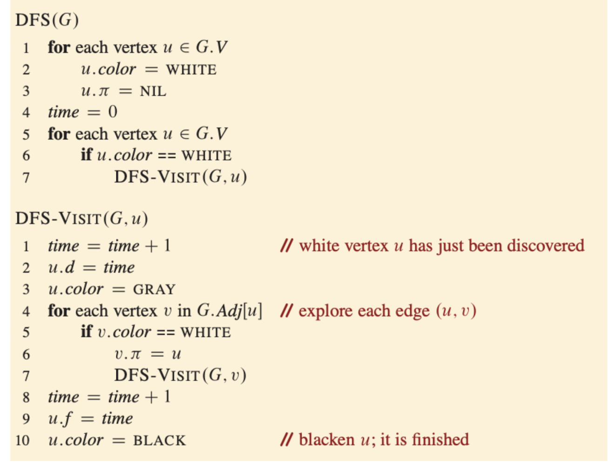
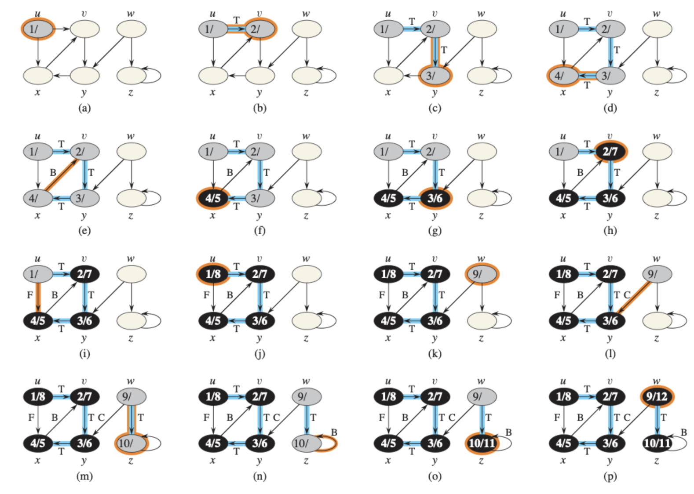

# Graph Algorithms

## Representation of graphs

### Undirected graph

### Directed graph

### Adjacency List
- requires $\Theta(V + E)$ memory
- $\Theta(V + E)$ runtime

### Adjacency Matrix
- requires $\Theta(V^2)$ memory
- $\Theta(V^2)$ runtime
- the matrix A of an undirected graph is its own transpose: $A = A^T$

## Breath-First Search

Breath-First Search systematically explores the edges of G to discover every vertex that is reachable from s.

It computes the distance from s to each reachable vertex where the distance to a vertex v equals the smallest number of edges needed to go from s to v.

- Algorithm works for both directed and undirected graph
- BFS uses queue
- BFS expands the frontier between discovered and undiscovered vertices uniformly across the breath of the frontier

BFS colors eacher vertex white, gray, or black. A vertex that is reachable from s is discovered the first time it is encountered during the search, at which time it becomes gray. The queue contains all gray vertices, eventually turns to black as discovered.

- enqueue and dequeue takes $O(1)$ time, total time devoted to queue operation is $O(V)$ because it scans adjacency list when dequeue.
- Scaning the list takes $O(V + E)$ eventually runtime of BFS is $O(V + E)$

## Depth-First Search

Depth-first search explores edges out of the most recently discovered vertex v that still has unexplored edges leaving it. Once all of v’s edges have been explored, the search backtracks to explore edges leaving the vertex from which v
was discovered.

- Runtime for DFS is $\Theta(V + E)$

