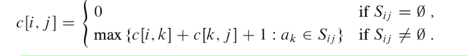
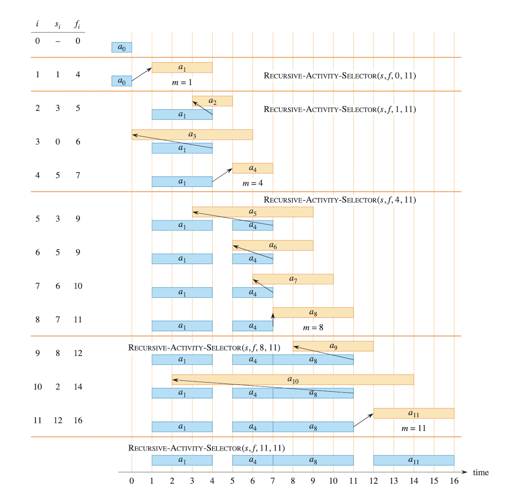

# Greedy Algorithm

## Activity selection

- Each activity $a_i$ has a start time $s_i$ and a finish time $f_i$, where $ 0 \leq s_i < f_i < \infty$
- Given n activities with start time: $s_1,..., s_n$ and finish time $f_1,..., f_n$
- Activity $a_i$ takes place during the half-open and $[s_i, f_i)$ do not overlap
- Only one can perform at a time
- In the activity selection problem, your goal is to select maximum size subset of mutually compatible acivitities

- Always pick the activity that finishes the earliest
    - Greedy choice

- If picking earliest
    - leaves the largest possible remaining time for future activities
    - give more room for more activities
- Runtime $O(nlogn)$ due to sorting
    - simpler
    - optimal choice

## Element of greedy strategy

- A globally optimal solution can be arrived at by making a locally optimal choice at each step without previous choices
- Can build incrementally, and each greedy choice decision is part of the final optimal choice
- An optimal solution to the problem contains within its optimal solutions to subproblems
    - Dynamic Programming solves all subproblems
    - Greedy only makes one choice per step
        - 0/1 knapsack - Dynamic Programming
            - if the most valuable load weighing at most W points includes item j, then the remaining load must be most valuable load weighing at most W - $w_j$
        - Fractional knapsack - Greedy
            - first compute the value per pound $v_i / w_i$ for each item. Obeying a greedy strategy, the thief begins by taking as much as possible of the item with the greatest value per pound