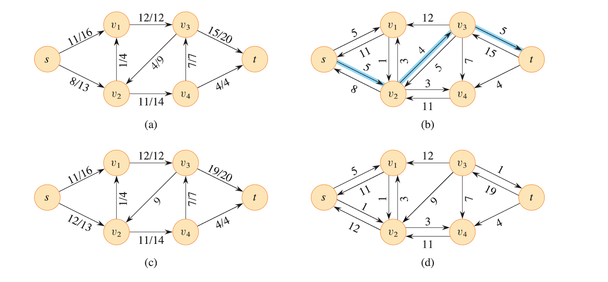

# Maximum Flow

### Reference

Chapter 24 in textbook

[Max Flow Ford Fulkerson | Network Flow | Graph Theory](https://www.youtube.com/watch?v=LdOnanfc5TM) by WilliamFlset

## 24.1 Flow Network

- Given directed graph where 
    - Each edge (u, v) has a capacity c(u, v)
        - $(u, v) \in E$
        - if $(u, v) \notin E$
            - $c(u, v)$ = 0
        - $c(u, v) \geq 0$
    - A **source** node s
    - A **sink** node t

- Source vertex $s$, Sink vertex $t$, assume $s \rightsquigarrow v \rightsquigarrow t$ for all $v \in V$, means that each vertex lies on path from source to sink.

- Goal is to find **maximum amount of flow** that can be pushed from **source** $s$ to **sink** $t$, subject to capacity constraints.

Each edge represents one conduit (전달자) and has a capacity, which is an upper bound on the flow rate = units / time

### Constraints
- Capacity constraint

    For all $u, v \in V$

    $$
    0 \leq f(u, v) \leq c(u, v)
    $$

    - Flow from one vertex to other vertex must be nonnegative and must not exceed the capacity

- Flow conversation

    For all $u \in V - \{s, t\}$ (Source Node, Sink Node)

    $$
    \sum_{v \in V} f(v, u) = \sum_{v \in V} f(u, v)
    $$
    
    - The total flow into a vertex other than source and sink must equal flow out of that vertex
    - When $(u, v) \notin E$, there can't be flow from $u$ to $v$, and make $f(u, v) = 0$
    - Nonnegative quantity $f(u, v)$ the flow from vertex $u$ to $v$, the value $|f|$ of a flow $f$ is defined as

    $$
    |f| = \sum_{v \in V} f(s, v) - \sum_{v \in V} f(v, s)
    $$

    - Total flow out of the source minus the flow into the source
    - The edge is displaced as flow / capacity

    - Equivalently

    $$
    \sum_{v \in V} f(s, v) - \sum_{v \in V} f(v, s) = 0
    $$

### Example of Flow

The Lucky Puck Company has a factory (source s) in Vancouver that manufactures
hockey pucks, and it has a warehouse (sink t) in Winnipeg that stocks them. Lucky
Puck leases space on trucks from another ûrm to ship the pucks from the factory
to the warehouse. Because the trucks travel over speciûed routes (edges) between
cities (vertices) and have a limited capacity, Lucky Puck can ship at most $c(u, v)$
crates per day between each pair of cities u and v.

## 24.2 The Ford-Fulkerson Method

The Ford-Fulkerson Method depends on three important ideas that transcend the method and are relevant to many flow algorithms and problems: residual network, augmenting paths, and cuts. These ideas are essential to the important max-flow mim-cut theorem, which characterizes the value of a maximum flow in terms of cuts of te flow network.

### Residual Graph

The residual graph $G_f$ represents how much additional flow you can push through the network.

If the capacity value is positive, that edge goes into $G_f$ with a "residual capacity" of $c_f(u, v) = c(u, v) - f(u, v)$. The edges of $G$ that belogn to $G_f$ are those that can admit more flow.

The value can be increased after update by bottleneck (병목) value but need to decrease with backward edge called residual edge. Reverse edges in the residual network allow an algorithm to send back flow it has already sent along an edge, which is necesary operation in many algorithms. 

Formally, for a flow network $G = (V, E)$ with source $s$ and sink $t$ and a flow $f$, consider a pair of vertices $u, v \in V$, it can be defined the residual capacity $c_f(u, v)$ by:

$$
c_f(u, v) =
\begin{cases}
c(u, v) - f(u, v) & \text{if } (u, v) \in E, \\
f(v, u) & \text{if } (v, u) \in E, \\
0 & \text{otherwise}.
\end{cases}
$$

- Forward Edge $(u, v)$: normal edge in the direction of flow
- Backward Edge $(u, v)$: allows to cancel previous flow

How to construct $G_f$
- For every edge $(u, v)$ in original graph:
    - If $f(u, v) < c(u, v)$, add **forward edge** $(u ,v)$ with residual capacity $c(u, v) - f(u, v)$
    - If $f(u ,v) > 0$, add **backward edge** $(u ,v)$ with capacity $f(u, v)$

### Augmenting Path

A path from source $s$ to sink $t$ in the residual graph where every edge has **positive residual capacity**.

- Push the minimum capacity (Bottleneck) along the path
    - can be found such as this way:
    

    1. Choose the path. In this case, I will choose the path $s \rightarrow v_2 \rightarrow v_1 \rightarrow v_3 \rightarrow t$
    2. Get the capacity and find the minumum capacity
        - min(13 - 0, 4 - 0, 12 - 0, 20 - 0) = min(13, 4, 12, 20) = 4
    3. Choose the other path and do this process but always capacity - flow
        - For instance, min(10 - 6, 15 - 6, 10 - 0) = min(4, 9, 10) = 4
- Example in textbook

### Max-Flow Min-cut Theorem

In any flow network, the maximum flow from $s \rightarrow t$ is equal to the minimum capacity among all s-t cuts

- Definition of cut

    - A cut is a partition of vertices into sets $S$ and $T$ such that:
        - $s \in S$, $t \in T$
        - The capacity of the cut is
        $$
        \text{cap}(S, T) = \sum_{u \in S, v \in T} c(u, v)
        $$
        - You can think of it as the total capacity that would be “cut” if you disconnected s from t

- The following are equivalent
    1. $f$ is a maximum flow
    2. $G_f$ has no augmenting path
    3. $|f| = c(S, T)$ for some cut $(S, T)$

### Core steps in Ford-Fulkerson Algorithm
1. Initialize $f(u, v) = 0;$  $\forall (u, v)$
2. While an augmenting paths exists in $G_f$:
    - Find the path $P$ from $s \rightarrow t$
    - Find $c_{min}$ = min residual capacity on $P$
    - For each edge $(u, v) \in P$:
        - Increase $f(u, v)$ by $c_{min}$
        - Decrease $f(u, v)$ (the backward flow) by $c_{min}$
3. When no path remains, total flow $\sum f(s, v)$ is the **Maximum Flow**

### Runtime of Algorithms

- Ford-Fulkerson: mainly uses DFS causing the runtime of $O(E \times \text{max flow})$

- Edmonds-Karp: Uses BFS as a method of finding augmenting paths, $O(E^2V)$

- Dinic's algorithm: Uses combination of BFS + DFS to find augmenting paths, $O(V^2E)$