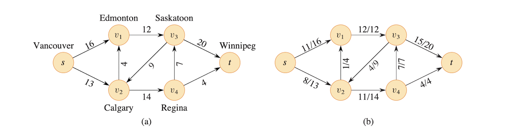

# Maximum Flow

Chapter 24 in textbook

## 24.1 Flow Network

- Given directed graph where 
    - Each edge (u, v) has a capacity c(u, v)
        - $(u, v) \in E$
        - if $(u, v) \notin E$
            - c(u, v) = 0
        - $c(u, v) \geq 0$
    - A **source** node s
    - A **sink** node t

- Source vertex $s$, Sink vertex $t$, assume $s \rightsquigarrow v \rightsquigarrow t$ for all $v \in V$, means that each vertex lies on path from source to sink.

- Goal is to find maximum amount of flow that can be pushed from source $s$ to sink $t$, subject to capacity constraints.

Each edge represents one conduit (전달자) and has a capacity, which is an upper bound on the flow rate = units/time

$$
E = mc^2
$$

### Constraints
- Capacity constraint

    For all $u, v \in V$

    $$
    0 \leq f(u, v) \leq c(u, v)
    $$

    - Flow from one vertex to other vertex must be nonnegative and must not exceed the capacity

- Flow conversation

    $f\colon[a,b]\to\R$

    For all $u \in V - \{s, t\}$ (Source Node, Sink Node)

    <!-- $\sum_{v \in V} f(v, u) = \sum_{v \in V} f(u, v)$ -->
    
    - The total flow into a vertex other than source and sink must equal flow out of that vertex