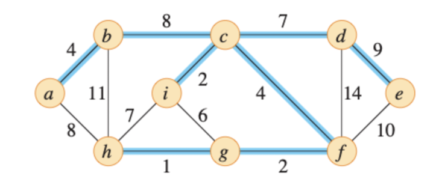
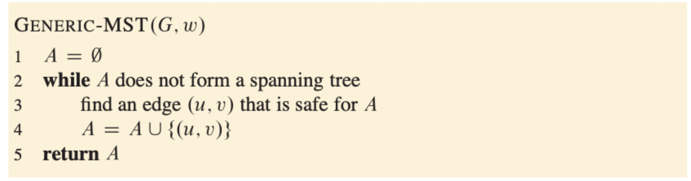
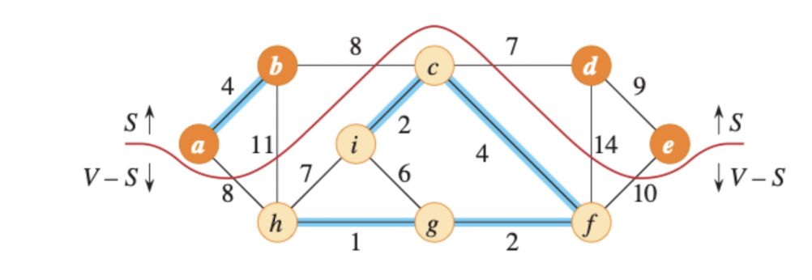
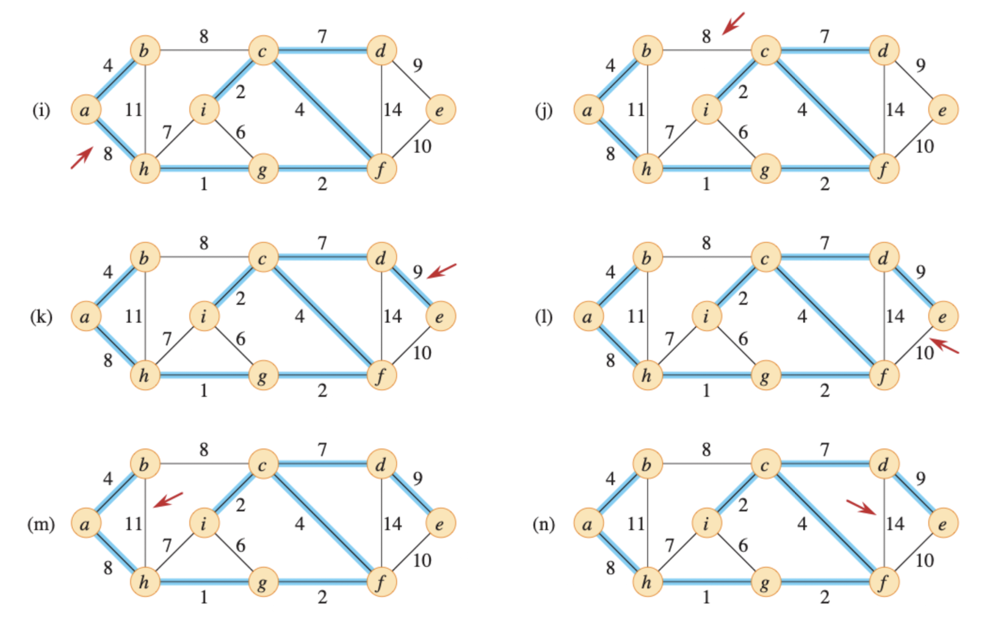
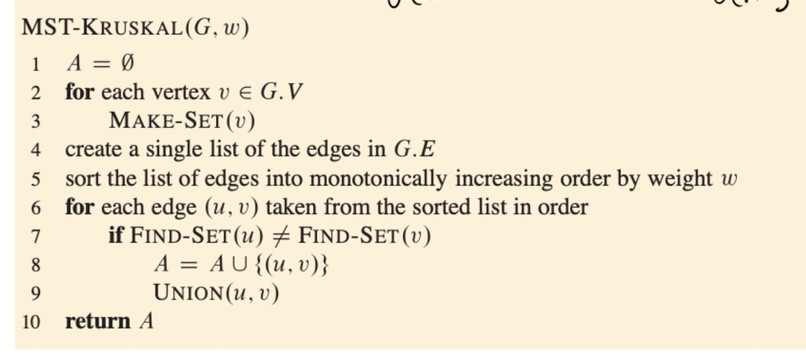

# Minimum Spanning Trees

- Need to use connected, undirected graph $G = (V, E)$, where V is the set of pins, E is set of possible interconnections between pairs aof pins and for each edge $(u, v) \in E$, a weight $w(u, v)$ specifies the cost to connect u and v.
$$
w(T) = \sum_{(u, v) \in T}w(u, v)
$$

Since T is acyclic (비순환적인) and connects all of the vertices, it must form a tree which we call a spanning tree since it spans (가로지르다) the graph G. 

- $|V| = n$ vertices
- $|E| = n - 1$ edges
- $|E| \subset |V| - 1 - $# cycle to find how many MST in graph

- Initialization: the set A trivally satisfies the loop invariant
- Maintenance: maintains the invariant by adding only safe edges
- Termination: All edges added to A belong tp a MST, and the loop must terminate by the time it has considered all edges
- Iterate $|V| - 1$ times

- can have different cost if there is weighted graph

## Kruskal Algorithm

- Choose the minimum cost edge
    - if the chosen edge forms a cycle, we don't choose that edge

- $|E| = |V| - 1$
- $\Theta(|V||E|)$
- $\Theta(n e) = \Theta(n^2)$
- can be improved if we use min heap so it doesn't need to search
    - $\Theta(nlogn)$
- Runtime of Kruskal is $O(E log V)$

## Prim Algorithm (Not covered)