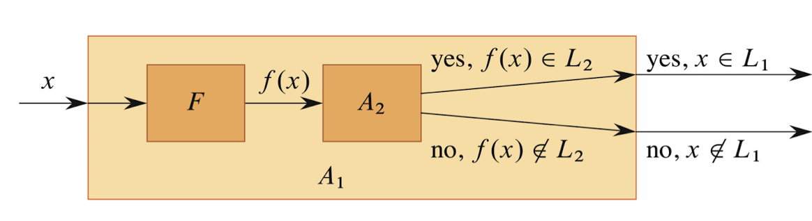
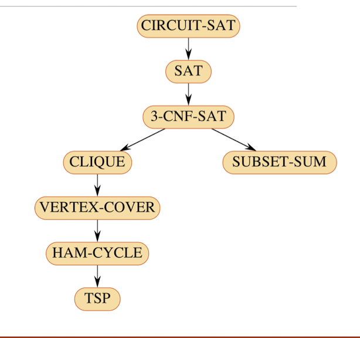
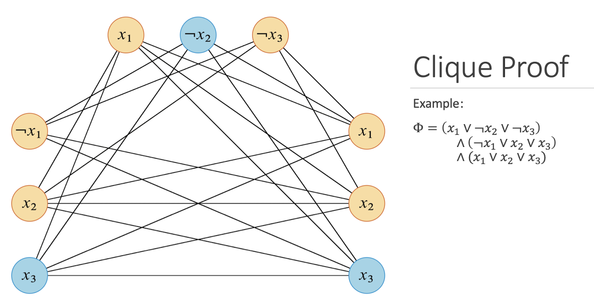

# NP-Completeness 

### Reference

Chapter 34 in textbook

[NP-Hard and NP-Complete Problems](https://www.youtube.com/watch?v=e2cF8a5aAhE) by Abdul Bari

[Clique Proof](https://www.youtube.com/watch?v=qZs767KQcvE) by Adul Bari

## Meaning of NP-Complete

NP-Completeness lies at the heart of the question

"Can every problem whose solution can be verified quickly also be solved quickly?"

### P (Polynomial Time)

- Class of problems that can be solved in polynomial time
    - For instance, there exists an algorithm that solves any instance of the problem in the time $O(n^k)$ for some constant $k$
- Examples
    - Sorting
    - Shortest path (Dijkstra)
    - Maximum Flow
    - Matrix Multiplication

### NP (Nondeterministic Polynomial Time)

- Class of problems where a solution can be verified in polynomial time
- Doesn't mean we can find the solution quickly - just that we can check it quickly

- Examples
    - Boolean satisfiability (SAT)
    - Hamiltonian Cycle
    - Subset sum

### NP-Complete (NPC) and NP-Hard

The hardest problems in NP - if you can solve one NP-complete problem quickly (in polynomial time), you can solve all NP problems quickly

- To be NP-Complete, a problem must satisfy two conditions:
    1. It is in NP (solutions can be verified quickly)
    2. Every other NP problem can be reduced to it in polynomial time

- If only satisfy one condition, it is NP-Hard

## Deterministic and Non-deterministic

- Determinisitic: Each and every statement how it works, we know clearly when we write statements we are sure how they work

- Non-deterministic: we don't know how it's working

Here is the example code:

```
// Assume those actions take 1 unit of time
Algorithm NSearch(A, n, key) {
    j = choice() <- Non-deterministic
    if (key = A[j]) {
        write(j)
        success() <-
    }
    write(0);
    Failure <-
}
```

### Satisfiability

Here is CNF - satisfiability

- There is $x_i = \{x_1, x_2, x_3\}$

    - Then $CNF = (x_1 \lor \lnot x_2 \lor x_3) \land (\lnot x_1 \lor x_2 \lor \lnot x_3)$

    - $(x_1 \lor \lnot x_2 \lor x_3)$ considered as $c_1$ and $(\lnot x_1 \lor x_2 \lor \lnot x_3)$ as $c_2$
    - There are two sections with 3 elements, it takes $2^3 => 2^n$

- Also in 0/1 Knapsack 
    - $p = \{10, 8, 12\}$, n = 3
    - $w = \{5, 4, 3\}$, n = 8
    - Then $x_i = \{\text{0/1}, \text{0/1}, \text{0/1}\}$
    - Which is also $2^3$ => $2^n$

- Satisfiability takes $2^n$

## NP-Complete

### Reduction

- A reduction is a way of transforming one problem into another such that solving the second problem allows you to solve first

- In NP-completeness, we are interested in:
    - $\text{Polynomial-Time Reduction: } A \leq_P B$

- This means:
    - Problem A can be converted to problem B
    - The conversion takes polynomial time
    - If there is an algorithm for B, we can use it to solve A efficiently.

- If you can reduce a known NP-complete problem to your new problem, and newer problem is in NP, then newer problem is also NP-complete.

- Let $L_1$ and $L_2$ be decision problems.
- A language $L_1$ is called polynomial-time reducible to language $L_2$, written $L_1 \leq_P L_2$, if there is a polynomial-time computable function $f$ such that:
$$
x \in L_1 \iff f(x) \in L_2
$$

- This means:
    - can transform any instance of $L_1$ into an instance of $L_2$
    - Solving $L_2$ tells you the answer to $L_1$

- Lemma:
    - If $L_1, L_2 \subseteq \{0, 1\}^*$ are the languages such that $L_1 \leq_P L_2$, then $L_2 \in P$ implies $L_1 \in P$.



### Certificates and Verifiability

- To show that a problem Q is in NP, we must show the following

- Given any instance $I$ of Q for which the answer is "yes", there is a certificate (that need verify) C of polynomial length such that given I and C, there is a polynomial-time algorithm to verify the "yes" answer

### NP-Complete and NP-Hard

- A language $L \subseteq \{0, 1\}^*$ is NP-Complete if 
    1. $L \in NP$ (verify program that is polynomial)
    2. $L' \leq_P L$ for every $L' \in NP$ (L is upperbound for every $L' \in NP$ )

- A language satisying condition 2 called NP-Complete
    - NP-Hard either one of them

### Common NP-Complete problems



There are several types of common NP-complete problems

- SAT (Boolean Satisfiability)
    - Input: a boolean formula (CNF form)
    - Question: Is there a truth assignment that makes the formula true?
    - e.g: $(x_1 \lor \lnot x_2) \land (\lnot x_1 \lor x_2)$

- 3-SAT
    - Still NP-completeness
    - mostly same as SAT

- Subset-Sum
    - Input: A set of integers $S = \{s_1, s_2,..., s_n \}$ and target sum t
    - Question: is there a subset that sums to t?

- Clique
    - Input: A graph $G = (V, E)$ and integer $k$
    - Question: Does G contain a clique (complete subgraph) size of k?

- Vertex-Cover
    - Input: the graph $G$ and integer $k$ $(k = |v|)$
    - Question: Can you select k vertices such that every edge touches at least one of them?

- Hamiltonian Cycle
    - Input: Graph G
    - Question: Is there a cycle that visits every vertex exactly once?

- Travelling Salesman Problem (TSP)
    - Input: weighted graph, and number $K$
    - Question: Is there a tour of all vertices with total cost $\leq K$?
    - 🧠 NP-complete if you ask "Is there a tour of cost ≤ K?"
    - 🟠 NP-hard if you ask "What is the minimum tour cost?"

### Clique Proof

1. Describe an algorithm to verify in polynomial time

- Input: A graph $G = (V, E)$, and a certificate could consist of a list of $k$ vertices $V'$ that form a clique in G
- Question: Does there exist a subset of k vertices such that every pair is connected by an edge?

- Verification would take $O(k^2)$ time since for each pair $u, v \in V'$ we need to confirm that edge $(u, v) \in E$

- Thus, Clique is NP
    - Given a set of $k$ vertices, we can check ${k} \choose {2}$ edges in polynomial time to verify they form a clique.

2. Describe an algorithm to transform a problem in polynomial time

- Will show:
    1. Clique $\in$ NP
    2. Clique is NP-Hard by reducing 3-SAT $\leq_P$ Clique

- Transformation
    - Let $I$ be an instance of 3-SAT with the formula $\Phi = C_1 \land C_2 \land ... C_k$
    - Each clause $C_r$ has three literals $I_1^r, I_2^r, I_3^r$
    - Each of these literals will become vertices in our graph
    - For each clause $C_r = (I_1^r \lor I_2^r, \lor I_3^r)$, we add three vertices $v_1^r, v_2^r, v_3^r$ to the graph
    - For each $v_i^r$ and $v_j^s$, we add an edge if
        - $r \neq s$
        - The literals $I_i^r$ and $I_j^s$ are consistent (not negatives of each other)

    - Example
        - Given the formula $\Phi = (x_1 \lor \lnot x_2 \lor \lnot x_3) \land (\lnot x_1 \lor x_2 \lor x_3) \land (x_1 \lor x_2 \lor x_3)$
        - Possible certificate: $x_1 = 0$, $x_2 = 0$, $x_3 = 1$
        
        

    - If we can satisfy the 3-SAT problem, then this graph has a clique of size k
        - If $\Phi$ is satisfiable then each clause $C_r$ must have at least one literal that is 1
        - Choose a subset $V'$ with one literal from each clause that is 1
        - $V'$ must form a clique since each vertex is from a different clause
    - This graph can be constructed in polynomial time. Thus, Clique is NP-Complete.

    