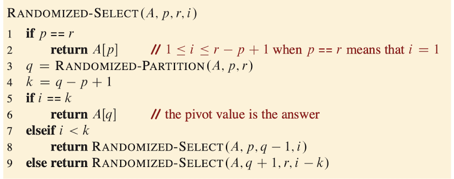
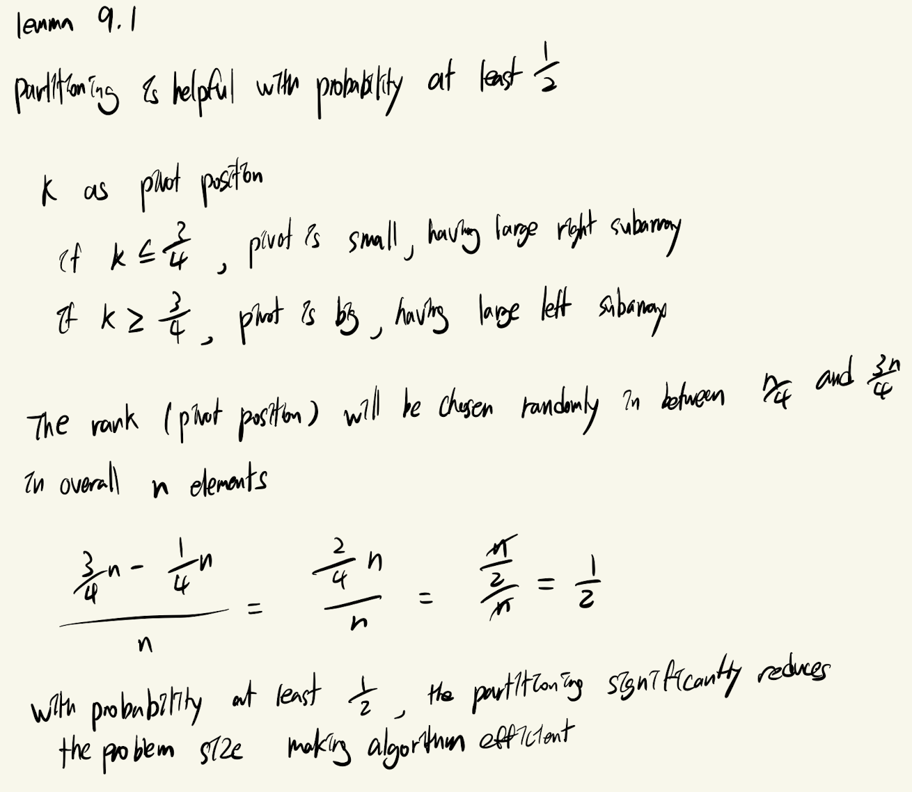

# Order Statistic

## Randomized Select
- The RANDOMIZED-SELECT procedure returns the ith smallest element
of the array $A[p:r]$, where $1 \leq i \leq r - p + 1$
    - p: starting index of the subarry
    - r: ending index of the subarray
    - i: ith smallest element to find in the given array

1. Randomly choose the pivot
2. Rearrange the array
    - if smaller than pivot, left
    - if larger than pivot, right
3. Check pivot's position (rank)
    - k = q - p + K
    - if i == k, pivot is ith smallest element
    - if i < k, smallest value on the left, recursive left
    - else, recursive right

- The pivot lies somewhere within the 2/4 and 3/4 range
- We expect to that half of the partitionings reduce the number of elements still in play by at least 3/4 and half of the partitioning do not help as much
