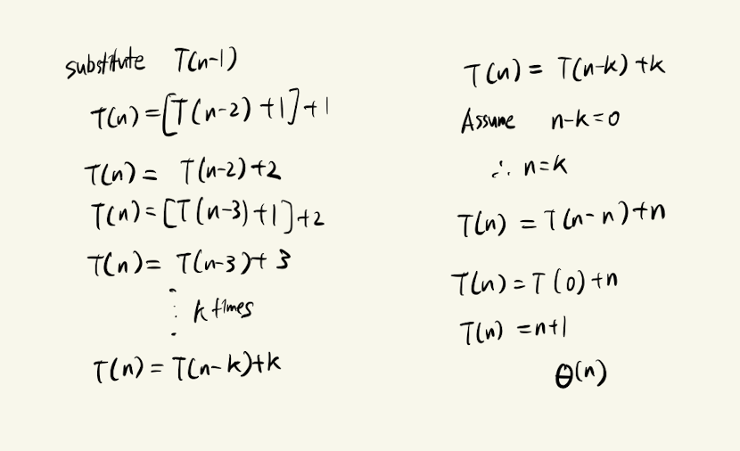
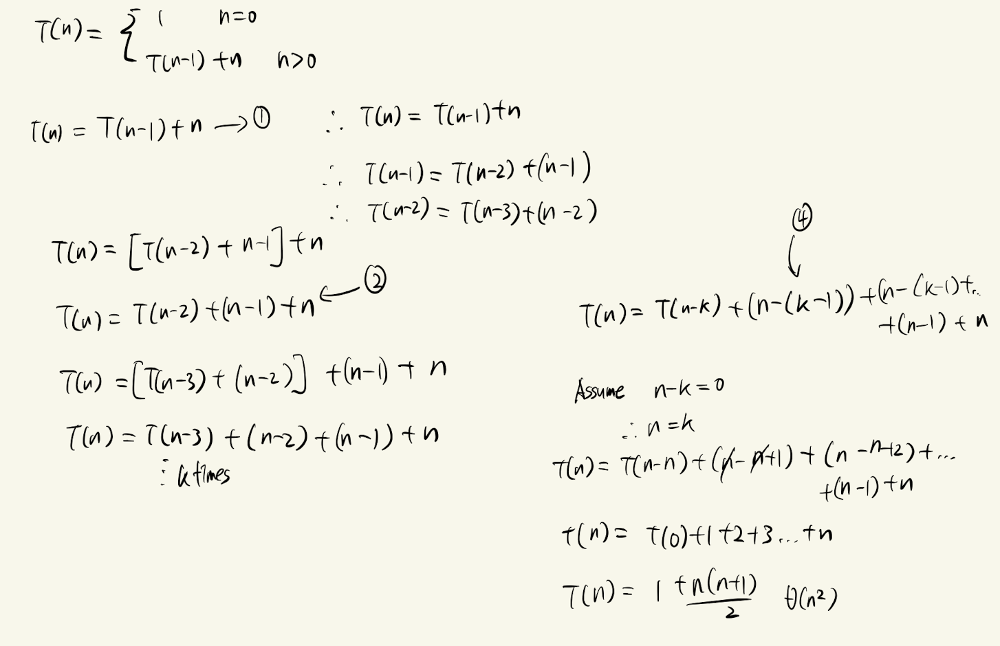
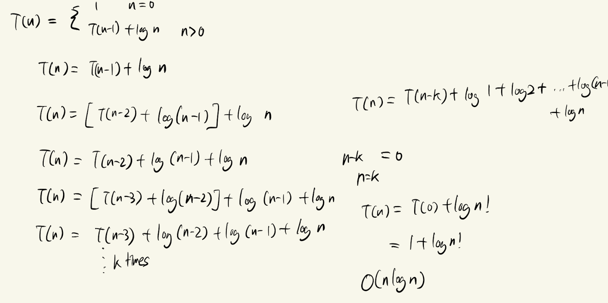
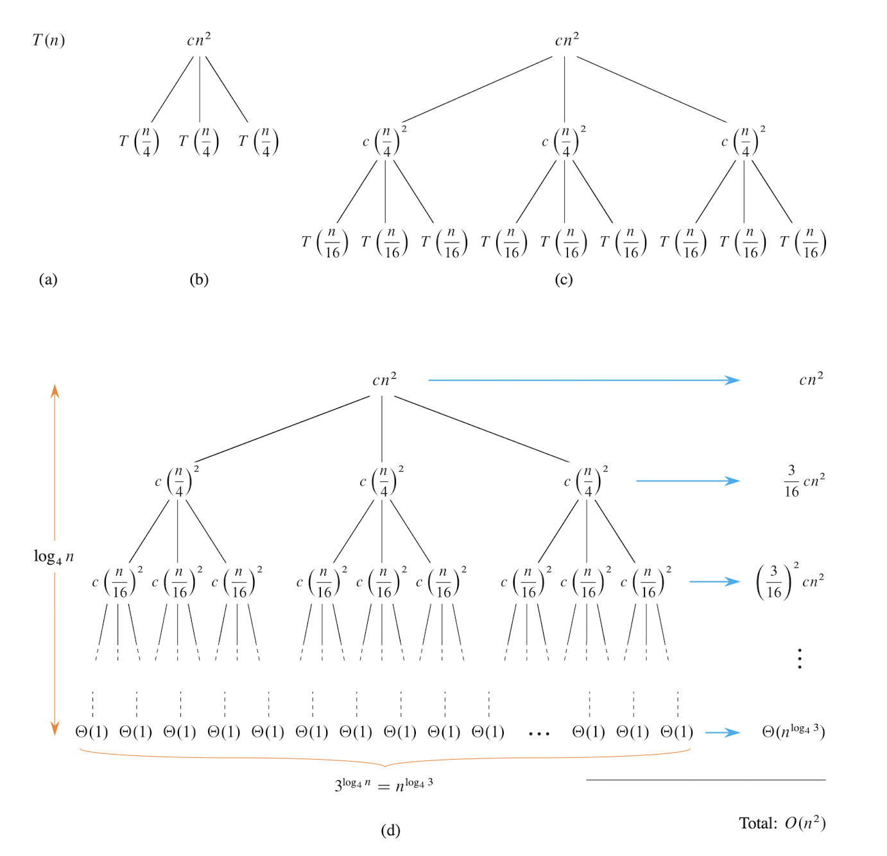
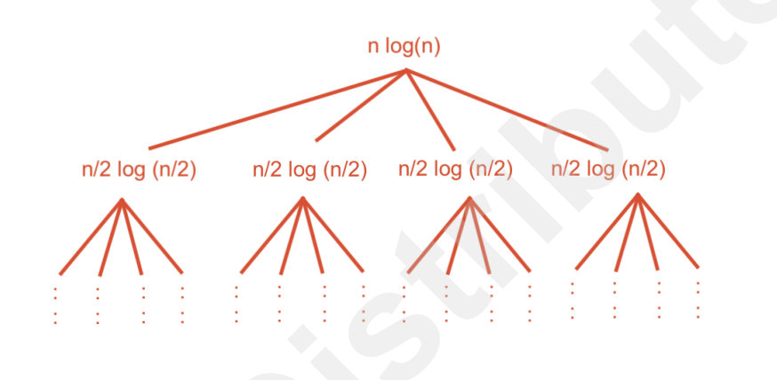
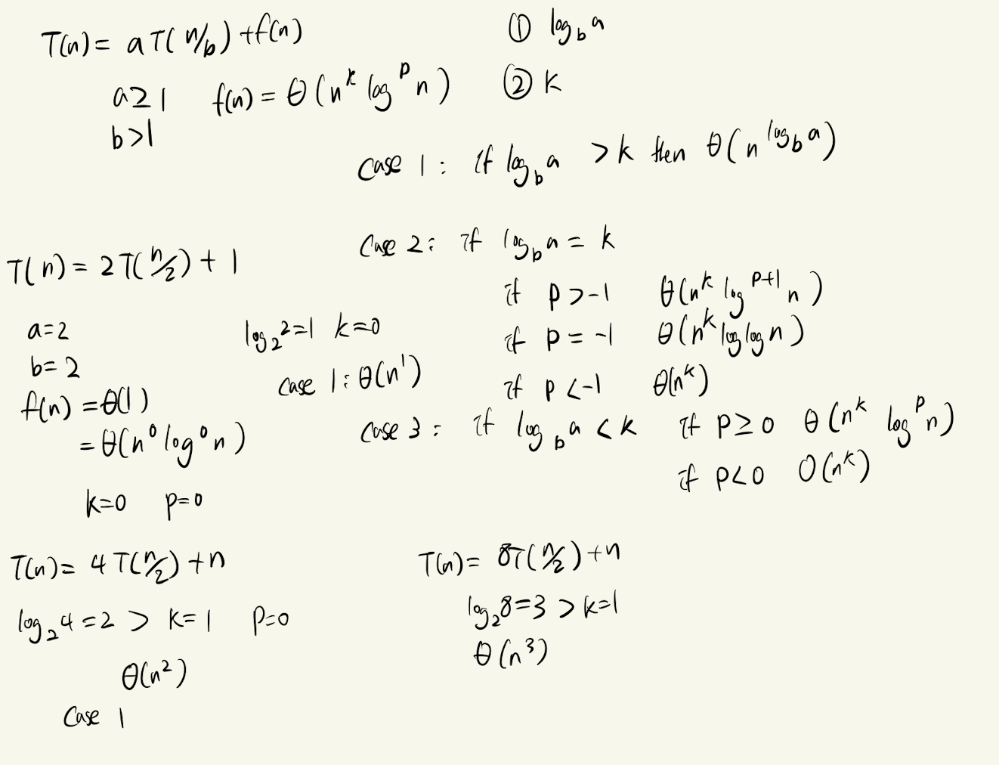
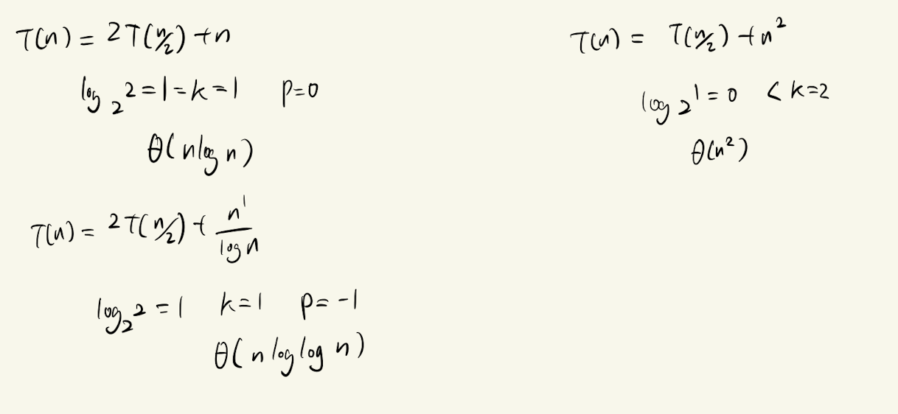

# Recurrence

## The substitution method

- Guess the solution and prove it by induction

## The recursion-tree method

$T(n) = 3T(n/4) + cn^2$

$T(n) = 4T(n/2) + \Theta (nlogn)$

- Height: log(n)
- Number of Nodes: $n^2$
- Work done at level i: a^i
## The master method

