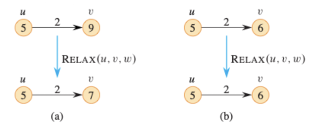
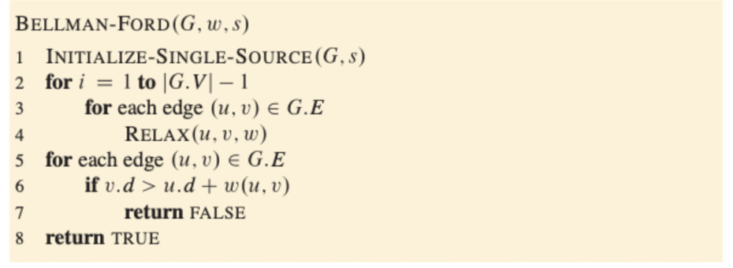
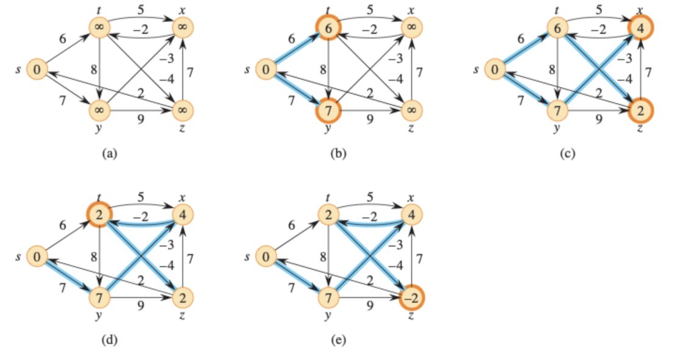
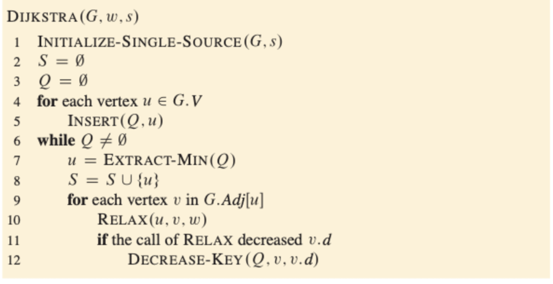
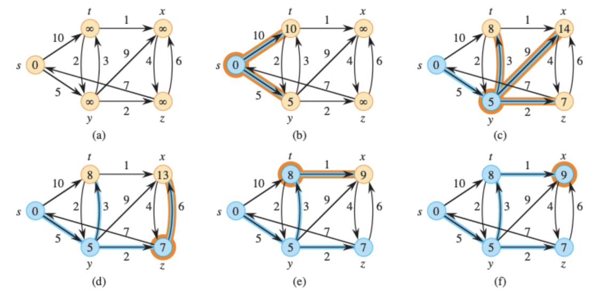

# Single Source Shortest Paths

## Relaxation

```
RELAX(u, v, w)
if v.d > u.d + w(u, v)
    v.d = u.d + w(u, v)
    u.pie = u
```


- if the value of u vertex and the cost of edge is bigger than v vertex, update the vertex v vertex value to u.d + c(u, v)

## The Bellman-Ford Algorithm
- List all edges
- can only relex max $|E| = |V| - 1$
- $O(|V||E|) = O(n^2)$
- In complete graph it takes $O(n^3)$





- Runtime $O(V^2 + VE)$

## Dijkstra's Algorithm
- Finds the shortest path
- No negative edges



